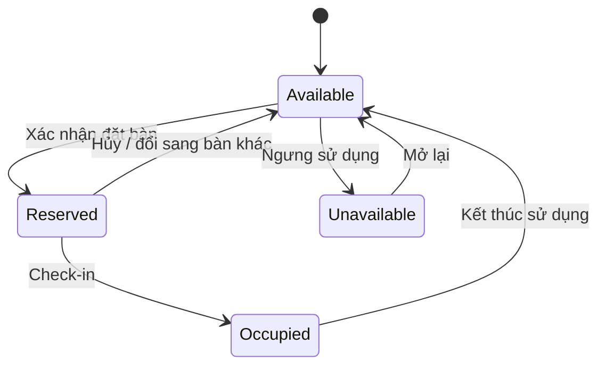
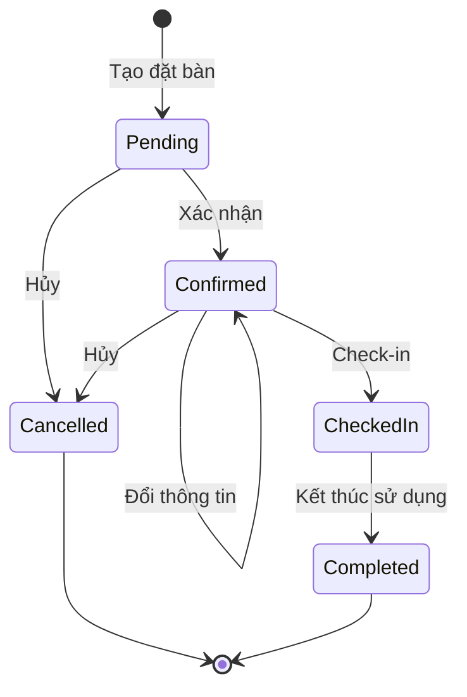
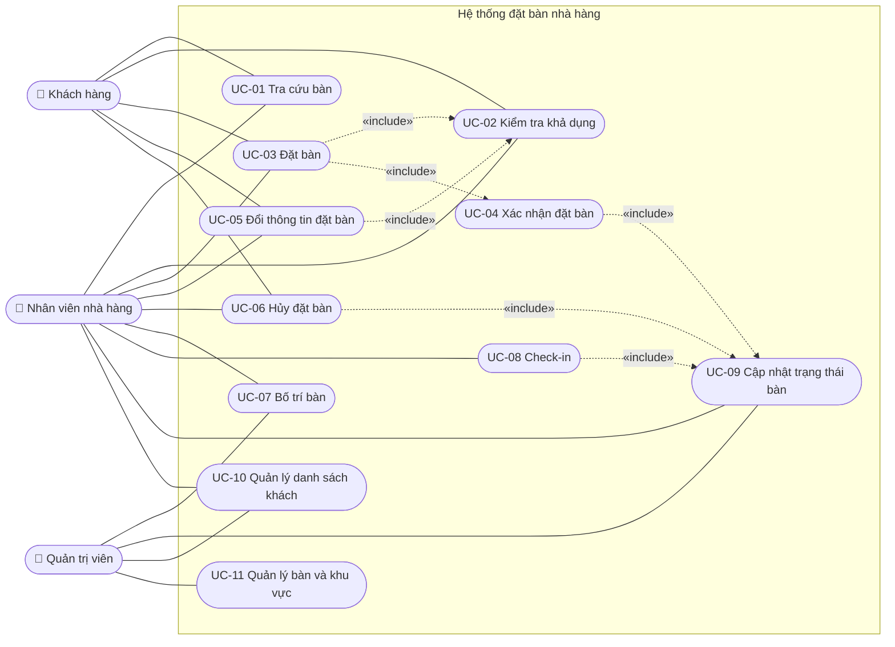
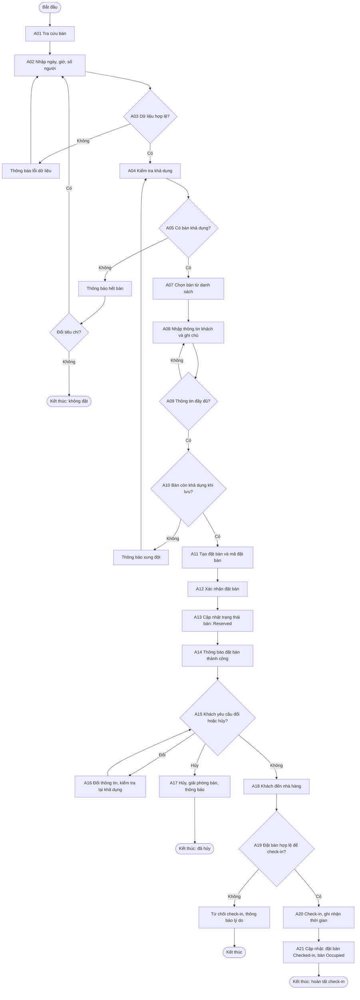
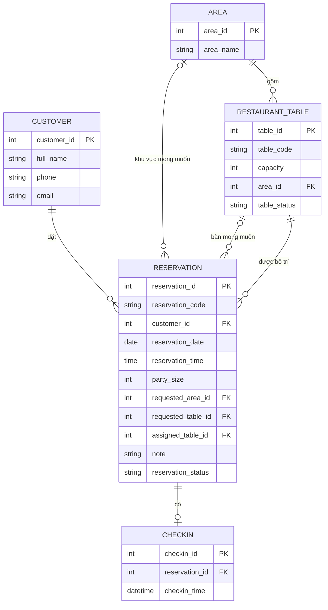
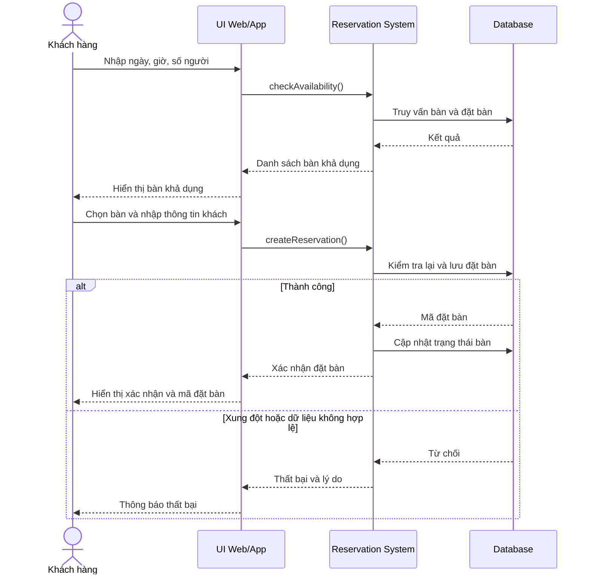
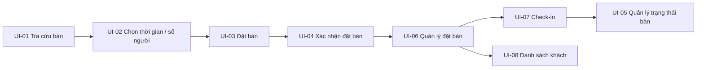

# Topic 1: Khảo sát hiện trạng, xác định bài toán và lựa chọn quy trình phát triển

> **Đề tài:** Hệ thống đặt bàn nhà hàng (Restaurant Table Reservation System)
> **Loại tài liệu:** Đặc tả ban đầu (Initial Specification) – Topic 1
> **Phạm vi tài liệu:** Phân tích, đặc tả và thiết kế mức khái niệm. Không bao gồm source code, backend/frontend hay cơ sở dữ liệu triển khai thật.

## Quy ước đánh dấu nguồn thông tin

Để đảm bảo truy vết và không trình bày giả định như dữ kiện, mọi nội dung trong tài liệu được gắn nhãn:

| Nhãn | Ý nghĩa |
|---|---|
| **[Đề bài]** | Dữ kiện được đề bài cung cấp trực tiếp |
| **[GĐ]** | Giả định nghiệp vụ (Assumption) – đề bài chưa nêu, tạm sử dụng, cần xác nhận |
| **[ĐX]** | Đề xuất của nhóm phát triển để hoàn thiện đặc tả |
| **[OQ]** | Câu hỏi mở (Open Question) – cần xác nhận với giảng viên / stakeholder |
| **BẮT BUỘC** | Deliverable bắt buộc của Topic 1 |
| **MỞ RỘNG** | Sản phẩm mở rộng, không thuộc yêu cầu bắt buộc |

## Mục lục

1. [Tổng quan đề tài](#1-tổng-quan-đề-tài)
2. [Phạm vi hệ thống](#2-phạm-vi-hệ-thống)
3. [Stakeholders / Actors](#3-stakeholders--actors)
4. [INPUT](#4-input)
5. [PROCESSING](#5-processing)
6. [OUTPUT](#6-output)
7. [Business Rules](#7-business-rules)
8. [Yêu cầu hệ thống (SRS)](#8-yêu-cầu-hệ-thống-srs)
9. [Use Case](#9-use-case)
10. [Activity Diagram](#10-activity-diagram)
11. [Class Diagram / ERD](#11-class-diagram--erd)
12. [Sequence Diagram](#12-sequence-diagram)
13. [UI Prototype](#13-ui-prototype)
14. [Lựa chọn quy trình phát triển](#14-lựa-chọn-quy-trình-phát-triển)
15. [Deliverables bắt buộc](#15-deliverables-bắt-buộc)
16. [Sản phẩm mở rộng](#16-sản-phẩm-mở-rộng)
17. [Input → Processing → Output](#17-input--processing--output)
18. [Traceability Matrix](#18-traceability-matrix)
19. [Assumptions](#19-assumptions)
20. [Open Questions](#20-open-questions)

---

## 1. Tổng quan đề tài

### 1.1. Bối cảnh

**[Đề bài]** Hệ thống đặt bàn nhà hàng hỗ trợ **khách hàng** và **nhân viên nhà hàng** quản lý quá trình đặt bàn, kiểm tra tình trạng bàn, bố trí bàn và check-in.

### 1.2. Thông tin đề bài cung cấp

| Hạng mục | Nội dung | Nguồn |
|---|---|---|
| Thông tin nghiệp vụ chính | Khách hàng; bàn; khu vực; thời gian; số người; trạng thái bàn | [Đề bài] |
| Chức năng nghiệp vụ chính | Tra cứu; kiểm tra khả dụng; đặt / đổi / hủy; bố trí bàn; check-in | [Đề bài] |
| Thông tin/kết quả cần quản lý | Xác nhận đặt bàn; trạng thái bàn; danh sách khách | [Đề bài] |
| Sản phẩm bắt buộc | Business rules; SRS; Use Case; Activity; Class/ERD; Sequence; UI prototype | [Đề bài] |
| Sản phẩm mở rộng | Web/App đặt bàn; sơ đồ bàn tương tác; QR check-in | [Đề bài] |

### 1.3. Khảo sát hiện trạng

Đề bài **không** mô tả quy trình đặt bàn hiện tại của nhà hàng. Các nhận định dưới đây là **giả định cần kiểm chứng** qua khảo sát (phỏng vấn, quan sát) ở các bước sau:

| Nhận định về hiện trạng | Nhãn | Cách kiểm chứng |
|---|---|---|
| Việc đặt bàn đang được ghi nhận thủ công hoặc rời rạc (điện thoại, sổ, tin nhắn, tại quầy) | [GĐ] | Phỏng vấn nhân viên, quan sát vận hành |
| Thông tin bàn, khách và đặt bàn không tập trung một nơi | [GĐ] | Khảo sát công cụ đang dùng |
| Rủi ro trùng lịch (double booking) và khó nắm trạng thái bàn tại một thời điểm | [GĐ] | Hỏi về sự cố đã xảy ra |

### 1.4. Phát biểu bài toán

Xây dựng hệ thống cho phép:

1. Tra cứu bàn và kiểm tra khả dụng theo **thời gian, số người** (và khu vực).
2. Tạo, xác nhận, đổi, hủy đặt bàn mà **không xảy ra trùng lịch**.
3. Bố trí bàn và **check-in** khách; luôn phản ánh đúng **trạng thái bàn** và **danh sách khách**.

Mục tiêu của Topic 1: khảo sát, xác định bài toán, lập đặc tả yêu cầu nền tảng và **lựa chọn quy trình phát triển** phù hợp.

---

## 2. Phạm vi hệ thống

### 2.1. In Scope (Topic 1)

| # | Nội dung | Nhãn |
|---|---|---|
| 1 | Tra cứu bàn; kiểm tra khả dụng | [Đề bài] |
| 2 | Đặt bàn, xác nhận đặt bàn | [Đề bài] |
| 3 | Đổi thông tin đặt bàn / đổi bàn; hủy đặt bàn | [Đề bài] |
| 4 | Bố trí bàn; check-in | [Đề bài] |
| 5 | Quản lý trạng thái bàn; quản lý danh sách khách | [Đề bài] |
| 6 | Bộ tài liệu bắt buộc: Business Rules, SRS, Use Case, Activity, Class/ERD, Sequence, UI Prototype | [Đề bài] |
| 7 | Quản lý dữ liệu danh mục bàn và khu vực (cần để hệ thống vận hành) | [ĐX] |

### 2.2. Out of Scope

| Nội dung | Ghi chú |
|---|---|
| Triển khai source code, backend/frontend, cơ sở dữ liệu thật | Ngoài phạm vi Topic 1 |
| Thanh toán online; khuyến mãi; tích điểm | Chưa được xác nhận → chỉ xem xét ở mục MỞ RỘNG / Open Questions |
| Phí hủy; thời gian giữ bàn; giới hạn đặt trước | Chưa được xác nhận → xem [Assumptions](#19-assumptions) và [Open Questions](#20-open-questions) |
| Gọi món, tính tiền (POS), quản lý kho, nhân sự | Không thuộc bài toán đặt bàn [ĐX] |
| Nhiều chi nhánh | Giả định hệ thống phục vụ **một** nhà hàng [GĐ] |
| Sản phẩm mở rộng (Web/App đầy đủ, sơ đồ bàn tương tác, QR check-in…) | Xem [mục 16](#16-sản-phẩm-mở-rộng) |

### 2.3. Assumptions và Open Questions

Tổng hợp tại [mục 19](#19-assumptions) và [mục 20](#20-open-questions).

---

## 3. Stakeholders / Actors

### 3.1. Stakeholders

| Stakeholder | Vai trò / mối quan tâm | Nhãn |
|---|---|---|
| Khách hàng | Đặt bàn thuận tiện, biết kết quả xác nhận, được đổi/hủy khi cần | [Đề bài] |
| Nhân viên nhà hàng | Tra cứu, bố trí bàn, check-in, nắm trạng thái bàn | [Đề bài] |
| Quản trị viên / quản lý nhà hàng | Quản lý dữ liệu bàn/khu vực, giám sát danh sách khách và đặt bàn | [ĐX] (đề bài chỉ nêu "có thể bao gồm") |
| Giảng viên | Người xác nhận yêu cầu, đánh giá tài liệu | [GĐ] |
| Nhóm phát triển | Phân tích, thiết kế, hiện thực | [GĐ] |

### 3.2. Actors của hệ thống

| Actor | Mô tả | Nhãn |
|---|---|---|
| **Khách hàng** | Người có nhu cầu đặt bàn; có thể tự tra cứu, đặt, đổi, hủy qua giao diện hệ thống | [Đề bài] |
| **Nhân viên nhà hàng** | Vận hành hằng ngày: tra cứu, đặt hộ khách, bố trí bàn, check-in, cập nhật trạng thái | [Đề bài] |
| **Quản trị viên** | Quản lý danh mục bàn/khu vực, giám sát toàn bộ dữ liệu | [ĐX] |

> **[GĐ]** Ở phiên bản cơ bản, khách có thể tự thao tác qua giao diện hệ thống **hoặc** nhân viên thao tác thay khách. Kênh Web/App đặt bàn đầy đủ (tài khoản, theo dõi, thông báo) là sản phẩm **MỞ RỘNG**. Xem [OQ-01](#20-open-questions).

---

## 4. INPUT

### 4.1. Dữ liệu khách hàng

| Trường | Mô tả | Bắt buộc | Nhãn |
|---|---|---|---|
| Họ tên | Tên khách đặt bàn | Có | [Đề bài] (trường); [GĐ] (bắt buộc) |
| Số điện thoại | Liên hệ, định danh khách | Có | [Đề bài] (trường); [GĐ] (bắt buộc) |
| Email | Liên hệ phụ | Không | [Đề bài] (trường); [GĐ] (tùy chọn) |
| Số lượng khách | Số người đi cùng | Có | [Đề bài] |

> **[ĐX]** "Số lượng khách" là thuộc tính của **từng lần đặt bàn** (không phải của khách hàng), nên được lưu ở thực thể `Reservation` (trùng với "Số người" ở 4.2).

### 4.2. Thông tin đặt bàn

| Trường | Mô tả | Bắt buộc | Nhãn |
|---|---|---|---|
| Ngày | Ngày dự kiến đến | Có | [Đề bài] |
| Giờ | Giờ dự kiến đến | Có | [Đề bài] |
| Số người | Số người của lần đặt | Có | [Đề bài] |
| Khu vực mong muốn | Khu vực khách ưu tiên | Không | [Đề bài] (trường); [GĐ] (tùy chọn) |
| Bàn mong muốn | Bàn cụ thể nếu khách có yêu cầu | Không | [Đề bài] ("nếu có") |
| Ghi chú | Yêu cầu bổ sung | Không | [Đề bài] |

### 4.3. Dữ liệu bàn

| Trường | Mô tả | Nhãn |
|---|---|---|
| Mã bàn | Định danh duy nhất của bàn | [Đề bài] |
| Sức chứa | Số người tối đa của bàn | [Đề bài] |
| Khu vực | Khu vực chứa bàn | [Đề bài] |
| Trạng thái bàn | Tình trạng bàn (xem [7.2](#72-trạng-thái-bàn)) | [Đề bài] (trường); [GĐ] (tập giá trị) |

### 4.4. Dữ liệu vận hành

| Trường | Mô tả | Nhãn |
|---|---|---|
| Thời gian check-in | Thời điểm khách được check-in | [Đề bài] |
| Trạng thái đặt bàn | Trạng thái vòng đời đặt bàn (xem [7.3](#73-trạng-thái-đặt-bàn)) | [Đề bài] (trường); [GĐ] (tập giá trị) |
| Yêu cầu đổi/hủy đặt bàn | Mã đặt bàn + nội dung thay đổi hoặc yêu cầu hủy | [Đề bài] |

### 4.5. Dữ liệu bổ sung do người dùng cấu hình

| Dữ liệu | Mục đích | Nhãn |
|---|---|---|
| Thời lượng sử dụng bàn dự kiến cho mỗi lượt đặt | Xác định khoảng thời gian bàn bị chiếm để kiểm tra trùng lịch; **giá trị chưa xác định** | [GĐ] / [OQ-02](#20-open-questions) |
| Khung giờ phục vụ của nhà hàng | Giới hạn giờ đặt hợp lệ; **giá trị chưa xác định** | [GĐ] / [OQ-03](#20-open-questions) |

---

## 5. PROCESSING

Luồng tổng quát:

```text
Khách nhập thời gian + số người → hệ thống kiểm tra bàn phù hợp → trả danh sách bàn khả dụng
→ khách chọn bàn → tạo đặt bàn → xác nhận → cập nhật trạng thái → (đến nhà hàng) check-in
```

> Ký hiệu: **BR-xx** = Business Rule ([mục 7](#7-business-rules)); **FR-xx** = Functional Requirement ([mục 8](#8-yêu-cầu-hệ-thống-srs)).

### 5.1. Tra cứu bàn

| Hạng mục | Nội dung |
|---|---|
| Điều kiện đầu vào | Có dữ liệu bàn/khu vực; tiêu chí tra cứu (khu vực, sức chứa, trạng thái – tùy chọn) |
| Các bước chính | (1) Người dùng nhập tiêu chí → (2) hệ thống lọc danh mục bàn → (3) hiển thị danh sách bàn và thông tin (mã, sức chứa, khu vực, trạng thái) |
| Quy tắc liên quan | BR-03 |
| Trạng thái thay đổi | Không thay đổi |
| Thành công | Hiển thị danh sách bàn theo tiêu chí |
| Thất bại / từ chối | Không có bàn khớp tiêu chí → thông báo "không có kết quả" |
| Yêu cầu | FR-01 |

### 5.2. Kiểm tra khả dụng

| Hạng mục | Nội dung |
|---|---|
| Điều kiện đầu vào | Ngày, giờ, số người hợp lệ; (tùy chọn) khu vực, bàn mong muốn |
| Các bước chính | (1) Xác thực dữ liệu đầu vào → (2) lọc bàn có sức chứa ≥ số người → (3) loại bàn không khả dụng → (4) loại bàn đã có đặt bàn hiệu lực chồng khoảng thời gian → (5) trả danh sách bàn khả dụng |
| Quy tắc liên quan | BR-01, BR-02, BR-03, BR-04 |
| Trạng thái thay đổi | Không thay đổi |
| Thành công | Có ít nhất một bàn khả dụng → hiển thị danh sách |
| Thất bại / từ chối | Dữ liệu không hợp lệ → thông báo lỗi; không có bàn phù hợp → thông báo hết bàn (có thể gợi ý đổi thời gian/khu vực [ĐX]) |
| Yêu cầu | FR-02, FR-03 |

### 5.3. Đặt bàn

| Hạng mục | Nội dung |
|---|---|
| Điều kiện đầu vào | Đã kiểm tra khả dụng; có bàn được chọn; có thông tin khách đầy đủ |
| Các bước chính | (1) Chọn bàn từ danh sách khả dụng → (2) nhập/xác nhận thông tin khách và ghi chú → (3) hệ thống kiểm tra lại khả dụng tại thời điểm lưu → (4) tạo bản ghi đặt bàn, sinh mã đặt bàn → (5) liên kết với khách hàng (tạo mới hoặc dùng lại) |
| Quy tắc liên quan | BR-01 → BR-05 |
| Trạng thái thay đổi | Đặt bàn: khởi tạo (`Pending` hoặc `Confirmed` – xem [OQ-04](#20-open-questions)) |
| Thành công | Tạo được đặt bàn, có mã đặt bàn |
| Thất bại / từ chối | Thiếu thông tin bắt buộc; bàn vừa bị đặt bởi lượt khác (xung đột) → từ chối, đề nghị chọn bàn/thời gian khác |
| Yêu cầu | FR-04, FR-05, FR-06, FR-07 |

### 5.4. Xác nhận đặt bàn

| Hạng mục | Nội dung |
|---|---|
| Điều kiện đầu vào | Đặt bàn đã được tạo hợp lệ |
| Các bước chính | (1) Hệ thống (hoặc nhân viên, tùy [OQ-04](#20-open-questions)) xác nhận → (2) đặt bàn chuyển sang `Confirmed` → (3) bàn được ghi nhận là đã đặt cho khoảng thời gian tương ứng → (4) hiển thị thông tin xác nhận kèm mã đặt bàn |
| Quy tắc liên quan | BR-01, BR-05, BR-10 |
| Trạng thái thay đổi | Đặt bàn: `Pending` → `Confirmed`; Bàn: `Available` → `Reserved` (xem [7.2](#72-trạng-thái-bàn)) |
| Thành công | Khách/nhân viên nhận xác nhận đặt bàn |
| Thất bại / từ chối | Xung đột khi xác nhận → từ chối và thông báo |
| Yêu cầu | FR-06, FR-14 |

### 5.5. Bố trí bàn

| Hạng mục | Nội dung |
|---|---|
| Điều kiện đầu vào | Đặt bàn ở trạng thái `Pending` / `Confirmed`; người thực hiện là nhân viên hoặc quản trị viên |
| Các bước chính | (1) Chọn đặt bàn → (2) hệ thống đề xuất các bàn phù hợp (sức chứa, thời gian, khu vực) → (3) nhân viên chọn bàn → (4) hệ thống kiểm tra BR-01/02/03 → (5) gán/đổi bàn cho đặt bàn |
| Quy tắc liên quan | BR-01, BR-02, BR-03, BR-12 |
| Trạng thái thay đổi | Bàn cũ (nếu có đổi): được giải phóng; bàn mới: `Reserved` |
| Thành công | Đặt bàn gắn với bàn mới, thông tin cập nhật |
| Thất bại / từ chối | Bàn mới không đủ sức chứa/không khả dụng/trùng lịch → từ chối, giữ nguyên bàn cũ |
| Yêu cầu | FR-10 |

### 5.6. Đổi thông tin đặt bàn

| Hạng mục | Nội dung |
|---|---|
| Điều kiện đầu vào | Có mã đặt bàn; đặt bàn ở trạng thái cho phép đổi (`Pending` / `Confirmed`); có nội dung thay đổi (thời gian, số người, bàn, khu vực, ghi chú, thông tin liên hệ) |
| Các bước chính | (1) Tìm đặt bàn theo mã → (2) kiểm tra trạng thái cho phép đổi → (3) nhập thông tin mới → (4) nếu đổi thời gian/số người/bàn: kiểm tra lại khả dụng → (5) cập nhật và thông báo |
| Quy tắc liên quan | BR-06, BR-01, BR-02, BR-03, BR-04 |
| Trạng thái thay đổi | Đặt bàn giữ `Confirmed` (hoặc `Pending`); bàn cũ được giải phóng, bàn mới `Reserved` nếu đổi bàn/thời gian |
| Thành công | Thông tin đặt bàn được cập nhật, có thông báo đổi thành công |
| Thất bại / từ chối | Đặt bàn đã `Checked-in`/`Cancelled`/`Completed`; thông tin mới không hợp lệ hoặc không còn bàn → từ chối, giữ nguyên đặt bàn cũ |
| Yêu cầu | FR-08, FR-14 |

> **[OQ-05]** Quy định về thời hạn cho phép đổi/hủy (trước giờ đặt bao lâu) chưa được cung cấp.

### 5.7. Hủy đặt bàn

| Hạng mục | Nội dung |
|---|---|
| Điều kiện đầu vào | Có mã đặt bàn; trạng thái cho phép hủy (`Pending` / `Confirmed`) |
| Các bước chính | (1) Tìm đặt bàn → (2) kiểm tra trạng thái → (3) xác nhận hủy → (4) cập nhật trạng thái đặt bàn → (5) giải phóng bàn cho khoảng thời gian đó → (6) thông báo |
| Quy tắc liên quan | BR-07, BR-08 |
| Trạng thái thay đổi | Đặt bàn: → `Cancelled`; Bàn: `Reserved` → `Available` (nếu không còn đặt bàn hiệu lực khác gắn với bàn) |
| Thành công | Đặt bàn bị hủy, bàn được giải phóng, có thông báo hủy |
| Thất bại / từ chối | Đặt bàn không tồn tại; đã `Checked-in`/`Completed`/`Cancelled` → từ chối |
| Yêu cầu | FR-09, FR-14 |

> Không áp dụng phí hủy ở phiên bản này (chưa có dữ liệu) – xem [OQ-06](#20-open-questions).

### 5.8. Check-in

| Hạng mục | Nội dung |
|---|---|
| Điều kiện đầu vào | Khách đến nhà hàng; có mã đặt bàn hoặc thông tin khách để tra cứu; đặt bàn `Confirmed` |
| Các bước chính | (1) Nhân viên tra cứu đặt bàn → (2) hệ thống xác minh đặt bàn hợp lệ → (3) ghi nhận thời gian check-in → (4) đặt bàn → `Checked-in` → (5) bàn → `Occupied` |
| Quy tắc liên quan | BR-09, BR-10 |
| Trạng thái thay đổi | Đặt bàn: `Confirmed` → `Checked-in`; Bàn: `Reserved` → `Occupied` |
| Thành công | Có thông tin check-in (thời gian, bàn, đặt bàn) |
| Thất bại / từ chối | Không tìm thấy đặt bàn; đặt bàn đã hủy/đã check-in/không hợp lệ → từ chối và thông báo lý do |
| Yêu cầu | FR-11 |

> Nhà hàng xử lý ra sao nếu khách đến sớm/trễ hoặc không đến (no-show): [OQ-07](#20-open-questions).

### 5.9. Cập nhật trạng thái bàn

| Hạng mục | Nội dung |
|---|---|
| Điều kiện đầu vào | Có sự kiện làm thay đổi trạng thái (xác nhận, hủy, đổi bàn, check-in, kết thúc sử dụng) hoặc nhân viên/quản trị viên cập nhật thủ công |
| Các bước chính | (1) Nhận sự kiện/yêu cầu → (2) kiểm tra chuyển trạng thái hợp lệ theo [7.2](#72-trạng-thái-bàn) → (3) cập nhật trạng thái → (4) phản ánh trên giao diện |
| Quy tắc liên quan | BR-10, BR-11 |
| Trạng thái thay đổi | `Available` ↔ `Reserved` → `Occupied` → `Available`; `Unavailable` (do quản trị/nhân viên đặt) |
| Thành công | Trạng thái bàn được cập nhật đúng |
| Thất bại / từ chối | Chuyển trạng thái không hợp lệ → từ chối |
| Yêu cầu | FR-12 |

### 5.10. Quản lý danh sách khách

| Hạng mục | Nội dung |
|---|---|
| Điều kiện đầu vào | Người dùng có quyền (nhân viên/quản trị viên) |
| Các bước chính | (1) Khi đặt bàn: tìm khách theo số điện thoại → (2) nếu chưa có: tạo mới; nếu có: dùng lại/cập nhật thông tin → (3) xem, tìm kiếm danh sách khách và các đặt bàn liên quan |
| Quy tắc liên quan | BR-04, BR-13 |
| Trạng thái thay đổi | Thêm/cập nhật bản ghi khách hàng |
| Thành công | Danh sách khách chính xác, không trùng lặp |
| Thất bại / từ chối | Dữ liệu khách không hợp lệ; trùng định danh khách → từ chối/gộp theo quy tắc |
| Yêu cầu | FR-13 |

---

## 6. OUTPUT

### 6.1. Output cho khách hàng

| Output | Mô tả | Quy trình nguồn |
|---|---|---|
| Danh sách bàn khả dụng | Các bàn phù hợp thời gian, số người, khu vực | 5.2 |
| Thông tin bàn được chọn | Mã bàn, sức chứa, khu vực | 5.3 |
| Xác nhận đặt bàn | Thông tin đặt bàn đã được xác nhận | 5.4 |
| Mã đặt bàn | Mã duy nhất để tra cứu/đổi/hủy (định dạng: [OQ-08](#20-open-questions)) | 5.3, 5.4 |
| Trạng thái đặt bàn | Trạng thái hiện tại của đặt bàn | 5.3 – 5.8 |
| Thông báo đặt bàn thành công / thất bại | Kết quả và lý do (nếu thất bại) | 5.3 |
| Thông báo khi đổi hoặc hủy | Kết quả đổi/hủy và thông tin sau thay đổi | 5.6, 5.7 |

### 6.2. Output cho nhân viên / quản trị viên

| Output | Mô tả | Quy trình nguồn |
|---|---|---|
| Danh sách bàn và trạng thái bàn | Toàn bộ bàn kèm trạng thái hiện tại | 5.1, 5.9 |
| Kết quả bố trí bàn | Bàn được gán cho đặt bàn | 5.5 |
| Thông tin check-in | Thời gian check-in, bàn, mã đặt bàn | 5.8 |
| Danh sách khách | Khách và các đặt bàn liên quan | 5.10 |
| Danh sách đặt bàn | Các đặt bàn theo ngày/trạng thái [ĐX] | 5.3 – 5.8 |
| Thông báo kết quả thao tác | Thành công/thất bại, lý do từ chối | Tất cả |

### 6.3. Output phục vụ quản lý hệ thống

| Output | Mô tả | Nhãn |
|---|---|---|
| Dữ liệu trạng thái bàn nhất quán | Trạng thái bàn khớp với các đặt bàn hiệu lực | [ĐX] |
| Dữ liệu đặt bàn lưu trữ | Bản ghi đặt bàn, check-in, khách phục vụ truy vấn | [ĐX] |
| Danh mục bàn/khu vực | Dữ liệu nền do quản trị viên quản lý | [ĐX] |
| Báo cáo thống kê, dashboard | Không bắt buộc ở Topic 1 | **MỞ RỘNG** |

---

## 7. Business Rules

### 7.1. Bảng Business Rules

| Rule ID | Business Rule | Mô tả | Nhãn |
|---|---|---|---|
| BR-01 | Không trùng lịch (no double booking) | Một bàn chỉ được xác nhận cho **một** đặt bàn tại cùng một khoảng thời gian; hai đặt bàn hiệu lực trên cùng bàn không được chồng khoảng thời gian | [Đề bài] |
| BR-02 | Số người phù hợp sức chứa | Số người của đặt bàn phải **không vượt quá sức chứa** của bàn được gán. Số người tối thiểu: [OQ-09](#20-open-questions) | [Đề bài] |
| BR-03 | Chỉ đặt bàn khả dụng | Chỉ bàn có trạng thái khả dụng (không `Unavailable` và không bị chiếm trong khoảng thời gian yêu cầu) mới được đặt | [Đề bài] |
| BR-04 | Thông tin bắt buộc khi đặt | Đặt bàn phải có thông tin khách (họ tên, số điện thoại), ngày, giờ, số người. Email, khu vực mong muốn, bàn mong muốn, ghi chú là tùy chọn | [Đề bài] (nguyên tắc); [GĐ] (danh sách trường bắt buộc) |
| BR-05 | Mã đặt bàn duy nhất | Mỗi đặt bàn có một mã duy nhất, dùng để tra cứu, đổi, hủy, check-in | [ĐX] |
| BR-06 | Đổi phụ thuộc trạng thái | Chỉ đặt bàn `Pending`/`Confirmed` mới được đổi; mọi thay đổi về thời gian/số người/bàn phải kiểm tra lại BR-01, BR-02, BR-03 | [Đề bài] (nguyên tắc); [GĐ] (tập trạng thái) |
| BR-07 | Hủy phụ thuộc trạng thái | Chỉ đặt bàn `Pending`/`Confirmed` mới được hủy; đặt bàn `Checked-in`, `Completed`, `Cancelled` không được hủy | [Đề bài] (nguyên tắc); [GĐ] (tập trạng thái) |
| BR-08 | Giải phóng bàn khi hủy | Khi đặt bàn bị hủy, bàn được giải phóng cho khoảng thời gian đó và có thể được đặt lại | [ĐX] |
| BR-09 | Check-in hợp lệ | Check-in chỉ thực hiện với đặt bàn **hợp lệ** (`Confirmed`, tồn tại, chưa hủy, chưa check-in). Cửa sổ thời gian cho phép check-in: [OQ-07](#20-open-questions) | [Đề bài] (nguyên tắc) |
| BR-10 | Cập nhật trạng thái sau check-in | Sau khi check-in, đặt bàn chuyển `Checked-in` và bàn chuyển `Occupied` | [Đề bài] |
| BR-11 | Chuyển trạng thái hợp lệ | Trạng thái bàn và đặt bàn chỉ chuyển theo sơ đồ vòng đời ở 7.2 và 7.3 | [ĐX] |
| BR-12 | Quyền bố trí bàn | Chỉ nhân viên/quản trị viên được bố trí hoặc đổi bàn cho đặt bàn; bàn mới phải thỏa BR-01, BR-02, BR-03 | [ĐX] |
| BR-13 | Định danh khách | Khách được nhận diện theo số điện thoại để tránh trùng lặp trong danh sách khách | [GĐ] |

### 7.2. Trạng thái bàn

**[GĐ]** Tập giá trị trạng thái bàn do đề bài chưa liệt kê cụ thể.

| Trạng thái | Ý nghĩa |
|---|---|
| `Available` (Khả dụng) | Bàn sẵn sàng, không có đặt bàn hiệu lực gắn với bàn tại thời điểm xét |
| `Reserved` (Đã đặt) | Có đặt bàn `Confirmed` gắn với bàn, khách chưa check-in |
| `Occupied` (Đang sử dụng) | Khách đã check-in và đang sử dụng bàn |
| `Unavailable` (Không khả dụng) | Bàn tạm ngưng sử dụng (do nhân viên/quản trị viên đặt) |



> Trạng thái "đang giữ" (hold) chỉ xuất hiện trong sơ đồ bàn tương tác (**MỞ RỘNG**), vì thời gian giữ bàn chưa được xác nhận.
> **[OQ-10]** Khả dụng của bàn cho **thời điểm tương lai** được xác định bằng cách kiểm tra các khoảng thời gian đặt bàn, còn trạng thái bàn ở trên phản ánh **tình trạng hiện tại**. Cần xác nhận cách thể hiện này.

### 7.3. Trạng thái đặt bàn

**[GĐ]** Tập giá trị do đề bài chưa liệt kê cụ thể.

| Trạng thái | Ý nghĩa |
|---|---|
| `Pending` | Đã tạo, chờ xác nhận (chỉ dùng nếu quy trình có bước duyệt – [OQ-04](#20-open-questions)) |
| `Confirmed` | Đã xác nhận, giữ bàn cho khoảng thời gian đặt |
| `Checked-in` | Khách đã đến và check-in |
| `Completed` | Kết thúc lượt sử dụng |
| `Cancelled` | Đã hủy |



### 7.4. Quy tắc chưa xác nhận (không áp dụng ở phiên bản này)

Các nội dung sau **không** được đưa vào Business Rules chính thức vì đề bài chưa cung cấp dữ liệu:

| Nội dung | Trạng thái | Tham chiếu |
|---|---|---|
| Thời gian giữ bàn (grace period) | Assumption / cần xác nhận | OQ-07 |
| Thời lượng sử dụng bàn mỗi lượt | Assumption / cần xác nhận | OQ-02 |
| Phí hủy / chính sách hủy theo thời gian | Assumption / cần xác nhận | OQ-05, OQ-06 |
| Giới hạn số ngày đặt trước | Assumption / cần xác nhận | OQ-11 |
| Giờ mở cửa, giờ đặt hợp lệ | Assumption / cần xác nhận | OQ-03 |
| Xử lý no-show | Assumption / cần xác nhận | OQ-07 |
| Ghép nhiều bàn cho nhóm đông | Assumption / cần xác nhận | OQ-12 |

---

## 8. Yêu cầu hệ thống (SRS)

### 8.1. System Scope

Hệ thống đặt bàn cho **một nhà hàng** [GĐ], gồm các chức năng tra cứu bàn, kiểm tra khả dụng, đặt/đổi/hủy, bố trí bàn, check-in, quản lý trạng thái bàn và danh sách khách (xem [mục 2](#2-phạm-vi-hệ-thống)).

### 8.2. Actors

Khách hàng, Nhân viên nhà hàng, Quản trị viên (xem [3.2](#32-actors-của-hệ-thống)).

### 8.3. Functional Requirements

| ID | Yêu cầu chức năng | Actor | Nhãn |
|---|---|---|---|
| FR-01 | Hệ thống cho phép tra cứu bàn theo khu vực, sức chứa, trạng thái | KH, NV | [Đề bài] |
| FR-02 | Hệ thống kiểm tra khả dụng theo ngày, giờ, số người (và khu vực nếu có) | KH, NV | [Đề bài] |
| FR-03 | Hệ thống trả danh sách bàn khả dụng phù hợp với tiêu chí | KH, NV | [Đề bài] |
| FR-04 | Hệ thống cho phép tạo đặt bàn với thông tin khách, thời gian, số người, khu vực/bàn mong muốn, ghi chú | KH, NV | [Đề bài] |
| FR-05 | Hệ thống kiểm tra tính hợp lệ của dữ liệu đặt bàn (trường bắt buộc, định dạng, sức chứa) | Hệ thống | [Đề bài] (suy ra) |
| FR-06 | Hệ thống sinh mã đặt bàn duy nhất và hiển thị xác nhận đặt bàn | Hệ thống | [Đề bài] |
| FR-07 | Hệ thống ngăn đặt trùng lịch trên cùng bàn (kể cả khi có nhiều yêu cầu đồng thời) | Hệ thống | [Đề bài] (suy ra) |
| FR-08 | Hệ thống cho phép đổi thông tin đặt bàn / đổi bàn theo quy tắc trạng thái | KH, NV | [Đề bài] |
| FR-09 | Hệ thống cho phép hủy đặt bàn theo quy tắc trạng thái | KH, NV | [Đề bài] |
| FR-10 | Hệ thống cho phép nhân viên/quản trị viên bố trí, gán và đổi bàn cho đặt bàn | NV, QTV | [Đề bài] |
| FR-11 | Hệ thống cho phép check-in đặt bàn hợp lệ và ghi nhận thời gian check-in | NV | [Đề bài] |
| FR-12 | Hệ thống cập nhật trạng thái bàn theo sự kiện và cho phép cập nhật thủ công có kiểm soát | NV, QTV | [Đề bài] |
| FR-13 | Hệ thống quản lý danh sách khách (thêm, xem, tìm kiếm, cập nhật) | NV, QTV | [Đề bài] |
| FR-14 | Hệ thống thông báo kết quả thành công/thất bại, kết quả đổi, hủy | Tất cả | [Đề bài] (suy ra) |
| FR-15 | Hệ thống cho phép quản trị viên quản lý danh mục bàn và khu vực | QTV | [ĐX] |
| FR-16 | Hệ thống giới hạn chức năng theo vai trò ở mức cơ bản (khách, nhân viên, quản trị viên) | Tất cả | [ĐX] |

> Quản lý tài khoản và phân quyền chi tiết là **MỞ RỘNG** (xem [mục 16](#16-sản-phẩm-mở-rộng)).

### 8.4. Non-functional Requirements

**[ĐX]** Các ngưỡng định lượng chưa có dữ liệu, cần xác nhận trước khi dùng làm tiêu chí nghiệm thu.

| ID | Nhóm | Yêu cầu | Ghi chú |
|---|---|---|---|
| NFR-01 | Tính toàn vẹn dữ liệu | Không để xảy ra trùng lịch kể cả khi nhiều người đặt đồng thời | Gắn FR-07, BR-01 |
| NFR-02 | Hiệu năng | Tra cứu và kiểm tra khả dụng phản hồi trong thời gian chấp nhận được | Ngưỡng cần xác nhận |
| NFR-03 | Tính dễ sử dụng | Giao diện rõ ràng, nhân viên thao tác đặt/check-in với số bước tối thiểu | Cần xác nhận với người dùng |
| NFR-04 | Bảo mật | Chức năng nhân viên/quản trị cần xác thực; dữ liệu cá nhân của khách (họ tên, số điện thoại, email) được bảo vệ | Cơ chế cụ thể cần xác nhận |
| NFR-05 | Độ tin cậy | Hệ thống có khả năng khôi phục dữ liệu đặt bàn khi sự cố | Mức dịch vụ cần xác nhận |
| NFR-06 | Tương thích | Giao diện sử dụng được trên trình duyệt phổ biến; hiển thị phù hợp màn hình nhỏ | Cần xác nhận nền tảng |
| NFR-07 | Khả năng bảo trì | Tách biệt quy tắc nghiệp vụ để thay đổi tham số (thời lượng, giờ phục vụ) mà không đổi cấu trúc | Hỗ trợ các [GĐ] |

### 8.5. Constraints

| ID | Ràng buộc | Nhãn |
|---|---|---|
| CON-01 | Topic 1 chỉ gồm đặc tả và thiết kế, không viết code, không triển khai CSDL thật | [Đề bài] |
| CON-02 | Phải có đủ 7 deliverables bắt buộc | [Đề bài] |
| CON-03 | Không đưa vào nghiệp vụ chưa xác nhận (thanh toán online, khuyến mãi, tích điểm, phí hủy, thời gian giữ bàn, giới hạn đặt trước) | [Đề bài] |
| CON-04 | Tài liệu bằng tiếng Việt, Markdown chuẩn GitHub | [Đề bài] |

### 8.6. Assumptions

Xem [mục 19](#19-assumptions).

---

## 9. Use Case

### 9.1. Use Case Diagram



> Quan hệ `«include»` thể hiện use case con luôn được thực hiện khi use case cha chạy. Quản trị viên được giả định có thêm quyền của nhân viên (kế thừa quyền) [GĐ].

### 9.2. Danh sách Use Case

| ID | Use Case | Actor chính | Mô tả ngắn | Yêu cầu | Nhãn |
|---|---|---|---|---|---|
| UC-01 | Tra cứu bàn | KH, NV | Xem/lọc bàn theo khu vực, sức chứa, trạng thái | FR-01 | [Đề bài] |
| UC-02 | Kiểm tra khả dụng | KH, NV | Xác định bàn khả dụng theo thời gian, số người | FR-02, FR-03 | [Đề bài] |
| UC-03 | Đặt bàn | KH, NV | Tạo đặt bàn cho bàn đã chọn | FR-04, FR-05, FR-07 | [Đề bài] |
| UC-04 | Xác nhận đặt bàn | Hệ thống / NV | Xác nhận và cấp mã đặt bàn | FR-06, FR-14 | [Đề bài] |
| UC-05 | Đổi thông tin đặt bàn | KH, NV | Thay đổi thời gian, số người, bàn, ghi chú | FR-08 | [Đề bài] |
| UC-06 | Hủy đặt bàn | KH, NV | Hủy đặt bàn hợp lệ | FR-09 | [Đề bài] |
| UC-07 | Bố trí bàn | NV, QTV | Gán/đổi bàn cho đặt bàn | FR-10 | [Đề bài] |
| UC-08 | Check-in | NV | Ghi nhận khách đến, cập nhật trạng thái | FR-11 | [Đề bài] |
| UC-09 | Cập nhật trạng thái bàn | NV, QTV | Cập nhật trạng thái bàn theo sự kiện/thủ công | FR-12 | [Đề bài] |
| UC-10 | Quản lý danh sách khách | NV, QTV | Thêm, xem, tìm, cập nhật khách | FR-13 | [Đề bài] |
| UC-11 | Quản lý bàn và khu vực | QTV | Thêm/sửa/ngưng sử dụng bàn và khu vực | FR-15 | [ĐX] |

### 9.3. Đặc tả mẫu: UC-03 Đặt bàn

| Mục | Nội dung |
|---|---|
| Actor chính | Khách hàng hoặc Nhân viên (đặt hộ) |
| Tiền điều kiện | Đã có dữ liệu bàn; actor đã nhập ngày, giờ, số người |
| Hậu điều kiện (thành công) | Có đặt bàn với mã duy nhất; bàn được ghi nhận cho khoảng thời gian; trạng thái cập nhật |
| Luồng chính | 1. Actor nhập ngày, giờ, số người (UC-02) → 2. Hệ thống trả danh sách bàn khả dụng → 3. Actor chọn bàn → 4. Actor nhập thông tin khách, ghi chú → 5. Hệ thống kiểm tra hợp lệ và khả dụng lần cuối → 6. Hệ thống tạo đặt bàn, cấp mã, xác nhận (UC-04) → 7. Hệ thống cập nhật trạng thái → 8. Hiển thị xác nhận |
| Luồng thay thế | 2a. Không có bàn khả dụng → thông báo, actor đổi thời gian/khu vực/số người |
| Luồng ngoại lệ | 5a. Thiếu/sai thông tin → báo lỗi, quay lại bước 4. 5b. Bàn vừa bị đặt → thông báo, quay lại bước 2 |
| Business Rules | BR-01, BR-02, BR-03, BR-04, BR-05 |

---

## 10. Activity Diagram

### 10.1. Luồng nghiệp vụ đặt bàn: Tra cứu → Kiểm tra → Đặt → Xác nhận → Check-in



### 10.2. Ghi chú

- **Bố trí bàn** (UC-07) có thể xảy ra giữa A12 và A18: nhân viên gán/đổi bàn (kiểm tra lại BR-01/02/03).
- Các luồng thay thế chi tiết của **đổi** và **hủy** được mô tả ở [5.6](#56-đổi-thông-tin-đặt-bàn) và [5.7](#57-hủy-đặt-bàn).

---

## 11. Class Diagram / ERD

### 11.1. ERD mức khái niệm

**[ĐX]** Các thực thể được đề xuất: `Customer`, `Area`, `RestaurantTable` (đặt tên tránh trùng từ khóa `TABLE` của SQL), `Reservation`, `CheckIn`.



### 11.2. Từ điển dữ liệu

| Thực thể | Thuộc tính chính | Khóa / ràng buộc | Nguồn thuộc tính |
|---|---|---|---|
| **Customer** | `customer_id`, `full_name`, `phone`, `email` | PK: `customer_id`; `phone` duy nhất [GĐ] | Họ tên, SĐT, email: [Đề bài] |
| **Area** | `area_id`, `area_name` | PK: `area_id` | Khu vực: [Đề bài] |
| **RestaurantTable** | `table_id`, `table_code`, `capacity`, `area_id`, `table_status` | PK: `table_id`; `table_code` duy nhất; FK: `area_id` → Area | Mã bàn, sức chứa, khu vực, trạng thái: [Đề bài] |
| **Reservation** | `reservation_id`, `reservation_code`, `customer_id`, `reservation_date`, `reservation_time`, `party_size`, `requested_area_id`, `requested_table_id`, `assigned_table_id`, `note`, `reservation_status` | PK: `reservation_id`; `reservation_code` duy nhất (BR-05); FK: `customer_id`, `requested_area_id`, `requested_table_id`, `assigned_table_id` | Ngày, giờ, số người, khu vực/bàn mong muốn, ghi chú, trạng thái: [Đề bài]; khóa, mã: [ĐX] |
| **CheckIn** | `checkin_id`, `reservation_id`, `checkin_time` | PK: `checkin_id`; FK: `reservation_id` → Reservation (duy nhất, quan hệ 1–0..1) | Thời gian check-in: [Đề bài] |

### 11.3. Ràng buộc dữ liệu liên quan Business Rules

| Ràng buộc | Quy tắc |
|---|---|
| `party_size` ≤ `capacity` của `assigned_table_id` | BR-02 |
| Không có hai `Reservation` hiệu lực (`Pending`/`Confirmed`/`Checked-in`) cùng `assigned_table_id` chồng khoảng thời gian | BR-01 |
| `customer_id`, ngày, giờ, `party_size` không rỗng | BR-04 |
| `reservation_code` duy nhất | BR-05 |
| `CheckIn` chỉ tạo khi `reservation_status` = `Confirmed` | BR-09 |

> **[OQ-02]** Khoảng thời gian bàn bị chiếm cần thêm thuộc tính thời lượng (ví dụ `duration`) hoặc giờ kết thúc dự kiến; chỉ bổ sung khi có xác nhận. Thể hiện nhiều bàn cho một đặt bàn: [OQ-12](#20-open-questions).

---

## 12. Sequence Diagram

### 12.1. Quy trình đặt bàn (SD-01)

```mermaid
sequenceDiagram
    actor KH as Khách hàng
    participant UI as UI Web/App
    participant RS as Reservation System
    participant DB as Database

    rect rgb(235, 245, 255)
    Note over KH,DB: Giai đoạn 1 - Kiểm tra khả dụng
    KH->>UI: Nhập ngày, giờ, số người (và khu vực)
    UI->>RS: checkAvailability(date, time, partySize, area)
    RS->>DB: Truy vấn bàn đủ sức chứa và đặt bàn hiệu lực
    DB-->>RS: Dữ liệu bàn và đặt bàn
    RS-->>UI: Danh sách bàn khả dụng
    UI-->>KH: Hiển thị bàn khả dụng
    end

    alt Không có bàn khả dụng
        UI-->>KH: Thông báo hết bàn
    else Có bàn khả dụng
        rect rgb(240, 255, 240)
        Note over KH,DB: Giai đoạn 2 - Tạo đặt bàn
        KH->>UI: Chọn bàn, nhập thông tin khách, ghi chú
        UI->>RS: createReservation(customerInfo, tableId, time, partySize, note)
        RS->>RS: Kiểm tra hợp lệ dữ liệu (BR-02, BR-04)
        RS->>DB: Kiểm tra lại khả dụng và lưu (giao dịch)
        alt Bàn đã bị đặt bởi lượt khác
            DB-->>RS: Xung đột
            RS-->>UI: Thất bại (trùng lịch)
            UI-->>KH: Thông báo chọn bàn/thời gian khác
        else Lưu thành công
            DB-->>RS: Lưu đặt bàn, mã đặt bàn
            end
        end
        end
    end
```

> Sơ đồ trên là bản nháp để minh họa; phiên bản đầy đủ cần chuẩn hóa lại khối `alt`/`end` khi vẽ bằng công cụ UML.

### 12.2. Luồng chuẩn hóa (bản rút gọn dùng cho Traceability)



**Quy ước tham chiếu:** `SD-01` trong Traceability tham chiếu sơ đồ **12.2**, với các giai đoạn *Kiểm tra khả dụng*, *Tạo đặt bàn*, *Xác nhận*, *Thông báo*.

> **[ĐX]** Sequence cho đổi, hủy, check-in được thiết kế tương tự (`SD-02` Đổi/Hủy, `SD-03` Check-in) ở bước hoàn thiện tài liệu.

---

## 13. UI Prototype

**[ĐX]** Mục này đặc tả nội dung các màn hình; bản prototype trực quan (wireframe/mockup) được thực hiện bằng công cụ thiết kế riêng và đối chiếu theo ID màn hình bên dưới.

### 13.1. Danh sách màn hình

| ID | Màn hình | Đối tượng | Mức độ | Use Case |
|---|---|---|---|---|
| UI-01 | Tra cứu bàn | KH, NV | **BẮT BUỘC** | UC-01 |
| UI-02 | Chọn thời gian / số người | KH, NV | **BẮT BUỘC** | UC-02 |
| UI-03 | Đặt bàn (nhập thông tin) | KH, NV | **BẮT BUỘC** | UC-03 |
| UI-04 | Xác nhận đặt bàn | KH, NV | **BẮT BUỘC** | UC-04 |
| UI-05 | Quản lý trạng thái bàn | NV, QTV | **BẮT BUỘC** | UC-09 |
| UI-06 | Quản lý đặt bàn (tìm, đổi, hủy, bố trí bàn) | KH, NV | [ĐX] bổ sung | UC-05, UC-06, UC-07 |
| UI-07 | Check-in | NV | [ĐX] bổ sung | UC-08 |
| UI-08 | Danh sách khách | NV, QTV | [ĐX] bổ sung | UC-10 |

> UI-06, UI-07, UI-08 không nằm trong danh sách giao diện bắt buộc của đề bài, nhưng cần để bao phủ đầy đủ chức năng đã xác định.

### 13.2. Đặc tả nội dung màn hình bắt buộc

| ID | Thành phần giao diện | Hành động | Thông báo / kiểm tra |
|---|---|---|---|
| UI-01 | Bộ lọc (khu vực, sức chứa, trạng thái); bảng/danh sách bàn (mã, sức chứa, khu vực, trạng thái) | Lọc, xem chi tiết bàn, chuyển sang UI-02 | "Không có bàn phù hợp" khi rỗng |
| UI-02 | Ô chọn ngày, giờ; ô số người; khu vực mong muốn (tùy chọn); nút "Kiểm tra bàn trống"; danh sách bàn khả dụng | Kiểm tra khả dụng, chọn bàn | Lỗi dữ liệu; thông báo hết bàn |
| UI-03 | Tóm tắt bàn/thời gian/số người; form họ tên, SĐT, email (tùy chọn), ghi chú; nút "Đặt bàn", "Quay lại" | Gửi đặt bàn | Thông báo trường bắt buộc; xung đột trùng lịch |
| UI-04 | Mã đặt bàn; thông tin khách; bàn, khu vực; ngày, giờ, số người; trạng thái đặt bàn; nút "Đổi", "Hủy" | Xem xác nhận; đổi/hủy (chuyển UI-06) | Thông báo đặt bàn thành công |
| UI-05 | Danh sách/bảng bàn kèm trạng thái (`Available`, `Reserved`, `Occupied`, `Unavailable`); bộ lọc; nút cập nhật trạng thái | Xem và cập nhật trạng thái hợp lệ | Từ chối chuyển trạng thái không hợp lệ |

### 13.3. Luồng điều hướng



---

## 14. Lựa chọn quy trình phát triển

# Development Process Selection

### 14.1. Đặc điểm của dự án ảnh hưởng đến việc chọn quy trình

| Đặc điểm | Biểu hiện trong Restaurant Table Reservation System |
|---|---|
| Yêu cầu chưa đầy đủ | Nhiều quy tắc chưa xác nhận (thời gian giữ bàn, thời lượng, hủy, giới hạn đặt trước…) → yêu cầu sẽ được bổ sung dần |
| Có lõi nghiệp vụ rõ ràng | Tra cứu → kiểm tra khả dụng → đặt → check-in là luồng chính ổn định |
| Có lớp mở rộng | Web/App, sơ đồ bàn tương tác, QR check-in có thể thêm sau |
| Rủi ro nghiệp vụ trọng tâm | Trùng lịch, đồng bộ trạng thái bàn |
| Quy mô | Hệ thống vừa và nhỏ, có thể chia thành các phần chức năng độc lập |
| Người dùng cuối | Nhân viên nhà hàng, khách hàng – có thể phản hồi sớm trên giao diện |

### 14.2. So sánh các quy trình

| Tiêu chí | Waterfall | Agile (nói chung) | Scrum | Spiral |
|---|---|---|---|---|
| Phù hợp khi yêu cầu chưa chắc chắn | Thấp | Cao | Cao | Cao |
| Phát hành sớm lõi nghiệp vụ | Thấp (cuối dự án) | Cao | Cao (mỗi Sprint) | Trung bình |
| Thêm sản phẩm mở rộng sau | Khó | Dễ | Dễ (backlog) | Dễ |
| Quản lý rủi ro | Hạn chế | Trung bình | Tốt qua review/retro | Rất tốt (phân tích rủi ro theo vòng) |
| Mức tài liệu | Rất nhiều | Vừa đủ | Vừa đủ, có DoD | Nhiều |
| Chi phí quản lý quy trình | Thấp | Thấp–trung bình | Trung bình | Cao |
| Phù hợp quy mô nhóm nhỏ, hệ thống vừa | Trung bình | Cao | Cao | Thấp (cồng kềnh) |

### 14.3. Lựa chọn chính: **Scrum** (thuộc họ Agile)

**Lý do phù hợp với Restaurant Table Reservation System:**

1. **Yêu cầu còn mở:** Nhiều quy tắc ([OQ-02] → [OQ-12]) chưa được xác nhận. Scrum cho phép cập nhật Product Backlog khi có thông tin mới thay vì "đóng băng" đặc tả như Waterfall.
2. **Giá trị chia theo lát cắt chức năng:** Mỗi Sprint có thể chuyển giao một phần dùng được (ví dụ: tra cứu + kiểm tra khả dụng, sau đó đặt bàn…).
3. **Phản hồi sớm từ người dùng:** Nhân viên nhà hàng có thể đánh giá giao diện đặt bàn/check-in sau mỗi Sprint Review.
4. **Sản phẩm mở rộng tách biệt:** Web/App, sơ đồ bàn tương tác, QR check-in là các Epic ưu tiên thấp hơn trong Backlog.
5. **Quy mô phù hợp:** Nhóm nhỏ, hệ thống vừa → chi phí quản lý Scrum chấp nhận được.

**Ưu điểm:** thích ứng thay đổi yêu cầu; có sản phẩm kiểm chứng được sớm; rủi ro nghiệp vụ (trùng lịch) được kiểm thử sớm; minh bạch tiến độ.

**Nhược điểm:** cần kỷ luật họp/ước lượng; tài liệu dễ thiếu nếu không có Definition of Done rõ; phạm vi dễ phình nếu Backlog không được kiểm soát.

**Rủi ro và biện pháp:**

| Rủi ro | Biện pháp |
|---|---|
| Yêu cầu thay đổi liên tục (Open Questions chưa chốt) | Đưa OQ vào Backlog; chốt các OQ trọng yếu trước Sprint liên quan |
| Trùng lịch phát sinh do thiết kế khả dụng sai | Xác định BR-01/FR-07 là tiêu chí chấp nhận (Acceptance Criteria) từ đầu; kiểm thử đồng thời |
| Scope creep (thêm thanh toán, khuyến mãi…) | Product Owner kiểm soát Backlog; nội dung chưa xác nhận chỉ vào mục MỞ RỘNG / OQ |
| Tài liệu không đồng bộ giữa các Sprint | Duy trì Traceability Matrix ([mục 18](#18-traceability-matrix)) như một phần của Definition of Done |

**Khi nên sử dụng:** yêu cầu chưa ổn định hoàn toàn, cần phản hồi sớm, có thể phân phối dần giá trị. **Khi không phù hợp:** yêu cầu đã cố định hoàn toàn và hợp đồng chặt về phạm vi (khi đó Waterfall có thể phù hợp hơn).

> **[ĐX]** Với Topic 1, nên có **Sprint 0 (khởi tạo)** để hoàn thành bộ tài liệu nền tảng (README này: Business Rules, SRS, Use Case, Activity, ERD, Sequence, UI Prototype) trước khi hiện thực.

### 14.4. Cách áp dụng Scrum vào project

| Khái niệm | Áp dụng trong project |
|---|---|
| **Product Backlog** | Danh sách có thứ tự ưu tiên: các FR bắt buộc (FR-01 → FR-14), FR-15/FR-16 [ĐX], các Epic mở rộng, các OQ cần làm rõ |
| **User Story** | Viết theo mẫu "Là <vai trò>, tôi muốn <việc> để <lợi ích>"; liên kết ngược FR/BR (xem ví dụ 14.5) |
| **Sprint** | Chu kỳ lặp ngắn, **độ dài do nhóm quyết định** (ví dụ 1–2 tuần là đề xuất [ĐX], cần xác nhận với giảng viên) |
| **Iteration / Increment** | Mỗi Sprint tạo một phần sản phẩm/tài liệu kiểm chứng được |
| **Feedback** | Sprint Review với giảng viên/người dùng đại diện; Sprint Retrospective trong nhóm; kết quả đưa lại vào Backlog |
| **Definition of Done** | Có tài liệu cập nhật (SRS/Use Case/…), Traceability Matrix đồng bộ, tiêu chí chấp nhận được thỏa mãn |

### 14.5. Ví dụ User Story (đề xuất)

| ID | User Story | Liên kết | Ưu tiên đề xuất |
|---|---|---|---|
| US-01 | Là khách hàng, tôi muốn kiểm tra bàn trống theo ngày, giờ, số người để biết có đặt được hay không | FR-02, FR-03, UC-02 | Cao |
| US-02 | Là khách hàng, tôi muốn đặt bàn và nhận mã đặt bàn để chắc chắn đã có chỗ | FR-04, FR-06, UC-03 | Cao |
| US-03 | Là nhân viên, tôi muốn hệ thống chặn đặt trùng bàn để tránh xung đột khi phục vụ | FR-07, BR-01 | Cao |
| US-04 | Là khách hàng, tôi muốn đổi hoặc hủy đặt bàn khi kế hoạch thay đổi | FR-08, FR-09 | Trung bình |
| US-05 | Là nhân viên, tôi muốn check-in khách và thấy bàn chuyển sang đang sử dụng | FR-11, FR-12, BR-10 | Cao |
| US-06 | Là nhân viên, tôi muốn bố trí/đổi bàn cho đặt bàn | FR-10 | Trung bình |
| US-07 | Là quản trị viên, tôi muốn quản lý danh mục bàn và khu vực | FR-15 | Trung bình |

### 14.6. Kế hoạch Sprint đề xuất

| Giai đoạn | Nội dung | Nhãn |
|---|---|---|
| Sprint 0 | Khảo sát, đặc tả (Topic 1), chốt Open Questions trọng yếu | [ĐX] |
| Sprint 1 | Tra cứu bàn, kiểm tra khả dụng (US-01) | [ĐX] |
| Sprint 2 | Đặt bàn, xác nhận, chống trùng lịch (US-02, US-03) | [ĐX] |
| Sprint 3 | Đổi/hủy, bố trí bàn (US-04, US-06) | [ĐX] |
| Sprint 4 | Check-in, trạng thái bàn, danh sách khách (US-05, FR-13) | [ĐX] |
| Sau đó | Các Epic mở rộng theo ưu tiên | **MỞ RỘNG** |

---

## 15. Deliverables bắt buộc

| # | Deliverable | Mức độ | Nội dung cần có | Vị trí trong README |
|---|---|---|---|---|
| 1 | **Business Rules** | **BẮT BUỘC** | Quy tắc nghiệp vụ; trạng thái bàn; quy định đặt/đổi/hủy; check-in; số người và sức chứa; chống double booking | [Mục 7](#7-business-rules) |
| 2 | **SRS** | **BẮT BUỘC** | Functional / Non-functional Requirements; Actors; System scope; Constraints; Assumptions | [Mục 8](#8-yêu-cầu-hệ-thống-srs), [2](#2-phạm-vi-hệ-thống), [19](#19-assumptions) |
| 3 | **Use Case Diagram** | **BẮT BUỘC** | Actor; Use Case chính; quan hệ Actor–Use Case | [Mục 9](#9-use-case) |
| 4 | **Activity Diagram** | **BẮT BUỘC** | Luồng đặt bàn: tra cứu → kiểm tra → đặt → xác nhận → check-in | [Mục 10](#10-activity-diagram) |
| 5 | **Class Diagram / ERD** | **BẮT BUỘC** | Thực thể/lớp chính, quan hệ, thuộc tính, khóa chính/ngoại | [Mục 11](#11-class-diagram--erd) |
| 6 | **Sequence Diagram** | **BẮT BUỘC** | Tương tác Khách hàng – UI – Reservation System – Database trong quy trình đặt bàn | [Mục 12](#12-sequence-diagram) |
| 7 | **UI Prototype** | **BẮT BUỘC** | Giao diện đặt bàn; tra cứu bàn; chọn thời gian/số người; xác nhận đặt bàn; quản lý trạng thái bàn | [Mục 13](#13-ui-prototype) |

### Checklist hoàn thành

- [x] Business Rules (README mục 7)
- [x] SRS: FR, NFR, Actors, Scope, Constraints, Assumptions (README mục 8, 2, 19)
- [x] Use Case Diagram + danh sách Use Case (README mục 9)
- [x] Activity Diagram (README mục 10)
- [x] ERD + từ điển dữ liệu (README mục 11)
- [x] Sequence Diagram đặt bàn (README mục 12)
- [x] Đặc tả UI Prototype (README mục 13) – **cần bổ sung bản vẽ wireframe/mockup trực quan**

---

## 16. Sản phẩm mở rộng

> Toàn bộ nội dung dưới đây là **MỞ RỘNG**, **không** thuộc yêu cầu bắt buộc của Topic 1.

### 16.1. Sản phẩm mở rộng theo đề bài

| # | Sản phẩm mở rộng | Mô tả | Liên hệ với phiên bản cơ bản |
|---|---|---|---|
| E-01 | **Web/App đặt bàn** | Khách đặt bàn trực tuyến; quản lý thông tin đặt bàn; theo dõi trạng thái | Mở rộng kênh cho UC-01 → UC-06 |
| E-02 | **Sơ đồ bàn tương tác** | Hiển thị trực quan vị trí bàn; phân biệt **bàn trống / đang giữ / đã đặt / đang sử dụng**; nhân viên chọn và bố trí bàn trực tiếp | Mở rộng UI-05 và UC-07; "đang giữ" cần chốt thời gian giữ ([OQ-07]) |
| E-03 | **QR Check-in** | Khách quét QR; xác thực đặt bàn; check-in nhanh; cập nhật trạng thái bàn | Mở rộng UC-08, tái sử dụng BR-09, BR-10 |

### 16.2. Đề xuất mở rộng thêm

| # | Tính năng | Ghi chú |
|---|---|---|
| E-04 | Email/SMS/notification xác nhận | Cần xác nhận kênh thông báo |
| E-05 | Nhắc lịch đặt bàn | Cần xác nhận thời điểm nhắc |
| E-06 | Quản lý lịch sử đặt bàn | Tra cứu đặt bàn trong quá khứ của khách |
| E-07 | Thống kê tỷ lệ sử dụng bàn | Dựa trên dữ liệu đặt bàn và check-in |
| E-08 | Dashboard cho quản lý | Tổng hợp thống kê, tình trạng bàn |
| E-09 | Phân quyền người dùng chi tiết | Mở rộng FR-16 (quản lý tài khoản, vai trò) |

### 16.3. Nội dung chỉ được xem xét sau khi có xác nhận

Thanh toán online, khuyến mãi, tích điểm, phí hủy, thời gian giữ bàn, chính sách đặt trước: chỉ xuất hiện trong [Open Questions](#20-open-questions) và **không** nằm trong phiên bản cơ bản.

---

## 17. Input → Processing → Output

| Chức năng | Input | Processing | Output |
|---|---|---|---|
| **Tra cứu** | Tiêu chí: khu vực, sức chứa, trạng thái | Lọc danh mục bàn theo tiêu chí | Danh sách bàn và thông tin bàn |
| **Kiểm tra khả dụng** | Ngày, giờ, số người, (khu vực, bàn mong muốn) | Xác thực dữ liệu → lọc theo sức chứa → loại bàn không khả dụng/chồng thời gian | Danh sách bàn khả dụng hoặc thông báo hết bàn |
| **Đặt bàn** | Thông tin khách (họ tên, SĐT, email), thông tin đặt bàn, bàn được chọn, ghi chú | Kiểm tra hợp lệ → kiểm tra lại khả dụng → tạo đặt bàn, sinh mã → xác nhận → cập nhật trạng thái | Mã đặt bàn, xác nhận đặt bàn, trạng thái đặt bàn/bàn, thông báo thành công/thất bại |
| **Đổi bàn / đổi thông tin** | Mã đặt bàn, thông tin mới (thời gian, số người, bàn, ghi chú) | Kiểm tra trạng thái cho phép → kiểm tra lại khả dụng → cập nhật đặt bàn → giải phóng bàn cũ/giữ bàn mới | Thông tin đặt bàn đã đổi, thông báo đổi thành công/thất bại |
| **Hủy bàn** | Mã đặt bàn, yêu cầu hủy | Kiểm tra trạng thái cho phép → chuyển `Cancelled` → giải phóng bàn | Thông báo hủy, trạng thái đặt bàn/bàn cập nhật |
| **Bố trí bàn** | Mã đặt bàn, bàn được chọn bởi nhân viên | Kiểm tra sức chứa, khả dụng, trùng lịch → gán/đổi bàn → cập nhật trạng thái | Kết quả bố trí, thông tin bàn được gán, trạng thái bàn |
| **Check-in** | Mã đặt bàn hoặc thông tin khách; thời gian check-in | Xác minh đặt bàn hợp lệ → ghi nhận check-in → cập nhật đặt bàn `Checked-in`, bàn `Occupied` | Thông tin check-in, trạng thái đặt bàn/bàn, thông báo kết quả |

---

## 18. Traceability Matrix

### 18.1. Ma trận truy vết

`Business Rule → Requirement → Use Case → Activity → Class/ERD → Sequence → UI`

| Business Rule | Requirement | Use Case | Activity | Class / ERD | Sequence | UI |
|---|---|---|---|---|---|---|
| BR-01 Không trùng lịch | FR-07, NFR-01, FR-02 | UC-02, UC-03, UC-05, UC-07 | A04, A10, A16 | `Reservation.assigned_table_id`, thời gian; `RestaurantTable` | SD-01 (kiểm tra lại và lưu) | UI-02, UI-03, UI-06 |
| BR-02 Số người ≤ sức chứa | FR-02, FR-05 | UC-02, UC-03, UC-05, UC-07 | A04, A09 | `Reservation.party_size` ≤ `RestaurantTable.capacity` | SD-01 (kiểm tra hợp lệ) | UI-02, UI-03 |
| BR-03 Chỉ đặt bàn khả dụng | FR-01, FR-02, FR-03 | UC-01, UC-02, UC-03 | A01, A04, A05 | `RestaurantTable.table_status` | SD-01 (kiểm tra khả dụng) | UI-01, UI-02 |
| BR-04 Thông tin bắt buộc khi đặt | FR-04, FR-05, FR-13 | UC-03, UC-10 | A02, A03, A08, A09 | `Customer`, `Reservation` (trường bắt buộc) | SD-01 | UI-02, UI-03 |
| BR-05 Mã đặt bàn duy nhất | FR-06 | UC-03, UC-04 | A11, A12 | `Reservation.reservation_code` | SD-01 (xác nhận) | UI-04 |
| BR-06 Đổi phụ thuộc trạng thái | FR-08, FR-14 | UC-05 | A15, A16 | `Reservation.reservation_status` | SD-02 (Đổi/Hủy) | UI-06 |
| BR-07 Hủy phụ thuộc trạng thái | FR-09, FR-14 | UC-06 | A15, A17 | `Reservation.reservation_status` | SD-02 (Đổi/Hủy) | UI-06 |
| BR-08 Giải phóng bàn khi hủy | FR-09, FR-12 | UC-06, UC-09 | A17 | `RestaurantTable.table_status`, `Reservation` | SD-02 | UI-05, UI-06 |
| BR-09 Check-in hợp lệ | FR-11 | UC-08 | A19, A20 | `CheckIn`, `Reservation.reservation_status` | SD-03 (Check-in) | UI-07 |
| BR-10 Cập nhật trạng thái sau check-in | FR-11, FR-12 | UC-08, UC-09 | A21, A13 | `CheckIn.checkin_time`, `RestaurantTable.table_status` | SD-03 | UI-05, UI-07 |
| BR-11 Chuyển trạng thái hợp lệ | FR-12 | UC-09 | A13, A21 | `table_status`, `reservation_status` | SD-01, SD-02, SD-03 | UI-05 |
| BR-12 Quyền bố trí bàn | FR-10, FR-16 | UC-07 | (A12 → A18, ghi chú 10.2) | `Reservation.assigned_table_id` | SD-02 (bố trí) | UI-06 |
| BR-13 Định danh khách | FR-13 | UC-10 | A08 | `Customer.phone` (duy nhất) | SD-01 | UI-03, UI-08 |

> `SD-01` = sơ đồ [12.2](#122-luồng-chuẩn-hóa-bản-rút-gọn-dùng-cho-traceability). `SD-02`, `SD-03` là sơ đồ **sẽ bổ sung** (xem ghi chú mục 12).

### 18.2. Truy vết yêu cầu không thuộc Business Rule

| Requirement | Use Case | Activity | Class / ERD | Sequence | UI |
|---|---|---|---|---|---|
| FR-14 Thông báo kết quả | UC-03 → UC-06 | A14, A17, A19E | (tầng giao diện) | SD-01 | UI-03, UI-04, UI-06 |
| FR-15 Quản lý bàn/khu vực | UC-11 | (ngoài luồng đặt bàn) | `RestaurantTable`, `Area` | Chưa thiết kế | Chưa có (cần bổ sung) |
| FR-16 Giới hạn theo vai trò | Tất cả | (không áp dụng) | (tầng ứng dụng) | Chưa thiết kế | Tất cả |

---

## 19. Assumptions

| ID | Giả định | Lý do / Ảnh hưởng | Trạng thái |
|---|---|---|---|
| AS-01 | Hệ thống phục vụ **một** nhà hàng, không nhiều chi nhánh | Đề bài không đề cập | Cần xác nhận |
| AS-02 | Họ tên và số điện thoại là bắt buộc; email, khu vực, bàn mong muốn, ghi chú là tùy chọn | Đề bài liệt kê trường nhưng không nêu bắt buộc | Cần xác nhận |
| AS-03 | Tập trạng thái bàn: `Available`, `Reserved`, `Occupied`, `Unavailable` | Đề bài chỉ nêu "trạng thái bàn" | Cần xác nhận |
| AS-04 | Tập trạng thái đặt bàn: `Pending`, `Confirmed`, `Checked-in`, `Completed`, `Cancelled` | Đề bài chỉ nêu "trạng thái đặt bàn" | Cần xác nhận |
| AS-05 | Mỗi đặt bàn gắn với **một** bàn tại một thời điểm | Đơn giản hóa; ghép bàn chưa được nêu | Cần xác nhận |
| AS-06 | Mỗi lượt đặt chiếm bàn trong một khoảng thời gian xác định bởi tham số cấu hình (chưa có giá trị) | Cần cho kiểm tra chồng lịch | Cần xác nhận |
| AS-07 | Khách được nhận diện theo số điện thoại | Tránh trùng lặp danh sách khách | Cần xác nhận |
| AS-08 | Ở phiên bản cơ bản, khách tự thao tác qua giao diện hệ thống hoặc nhân viên thao tác hộ; Web/App đầy đủ là mở rộng | Phân định cơ bản/mở rộng | Cần xác nhận |
| AS-09 | Check-in do nhân viên thực hiện; check-in bằng QR là mở rộng | Phù hợp phân loại đề bài | Cần xác nhận |
| AS-10 | Quản trị viên có toàn bộ quyền của nhân viên và quản lý danh mục bàn/khu vực | Đề bài chỉ nêu "có thể bao gồm" quản trị viên | Cần xác nhận |
| AS-11 | Chưa áp dụng: thời gian giữ bàn, phí hủy, giới hạn đặt trước, thanh toán, khuyến mãi, tích điểm | Chưa có dữ liệu, theo ràng buộc đề bài | Chờ xác nhận |

---

## 20. Open Questions

| ID | Câu hỏi cần xác nhận | Ảnh hưởng đến | Người xác nhận đề xuất |
|---|---|---|---|
| OQ-01 | Phiên bản cơ bản do khách tự đặt, nhân viên đặt hộ, hay cả hai? Phân định rõ phần nào thuộc Web/App mở rộng? | Actor, Use Case, UI | Giảng viên |
| OQ-02 | Một lượt đặt chiếm bàn trong bao lâu (cố định/cấu hình/khách chọn)? | BR-01, ERD, kiểm tra khả dụng | Giảng viên / nhà hàng |
| OQ-03 | Khung giờ phục vụ và giờ đặt bàn hợp lệ? | Validate dữ liệu, NFR | Nhà hàng |
| OQ-04 | Đặt bàn được xác nhận tự động hay cần nhân viên duyệt (có trạng thái `Pending`)? | Vòng đời đặt bàn, UC-04 | Giảng viên |
| OQ-05 | Có quy định thời hạn đổi/hủy trước giờ đặt không? | BR-06, BR-07 | Nhà hàng |
| OQ-06 | Có phí hoặc chính sách hủy không? | BR-07 (hiện không áp dụng) | Nhà hàng |
| OQ-07 | Có thời gian giữ bàn, xử lý khách đến sớm/trễ, no-show như thế nào? | BR-09, trạng thái bàn, check-in | Nhà hàng |
| OQ-08 | Định dạng mã đặt bàn? | BR-05, UI-04 | Giảng viên |
| OQ-09 | Có giới hạn số người tối thiểu so với sức chứa bàn không (ví dụ tránh xếp 1 người vào bàn lớn)? | BR-02 | Nhà hàng |
| OQ-10 | Trạng thái bàn thể hiện tình trạng hiện tại hay theo từng khung thời gian? | ERD, BR-11, UI-05 | Giảng viên |
| OQ-11 | Có giới hạn số ngày đặt trước tối đa không? | Validate ngày | Nhà hàng |
| OQ-12 | Có hỗ trợ ghép nhiều bàn cho nhóm đông không? | ERD (quan hệ nhiều-nhiều), BR-02 | Nhà hàng |
| OQ-13 | Cần thêm sơ đồ nào ngoài bộ bắt buộc (State Diagram, Component…)? | Deliverables | Giảng viên |
| OQ-14 | Chọn Scrum có phù hợp với yêu cầu của môn học (độ dài Sprint, vai trò Scrum)? | Mục 14 | Giảng viên |

---

*Tài liệu đặc tả ban đầu cho Topic 1 – Hệ thống đặt bàn nhà hàng. Phiên bản cần cập nhật khi các Open Questions được xác nhận.*****
